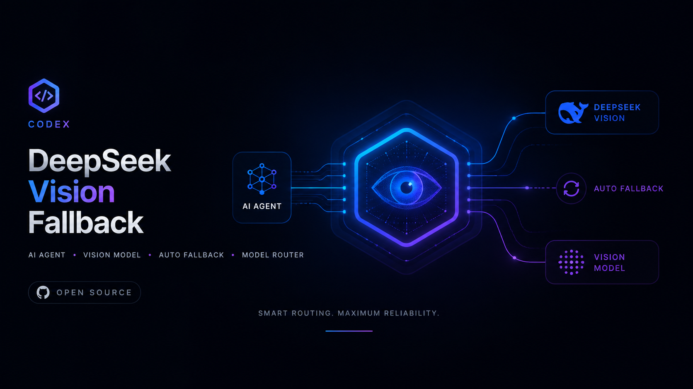
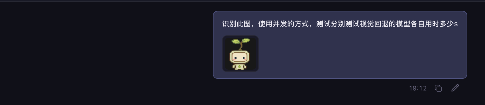
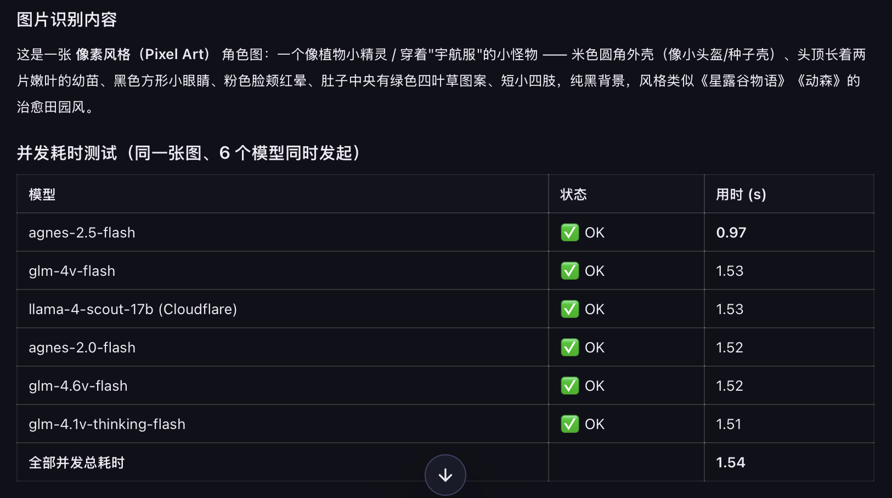

# Codex / DeepSeek 视觉回退（多模型自动切换）



让没有原生视觉能力的编码代理（如 DeepSeek）自动读图：把图片转成文字描述，交还给原模型继续处理。**官方 Codex / GPT 保持原生识图，绝不把图片额外发送给第三方 API**。

## 特性

- **多模型自动切换**：每个模型失败一次立即切下一个（429 限流 / 超时 / 密钥无效等），无需手工干预
- **一句话配置向导**：说一句「配置 API key」即可弹出终端表单，隐藏输入各大厂商密钥并自动测试有效性
- **全免费 + 速度优先**默认链路，也支持接入付费旗舰模型
- **大图自动压缩**：>1.5MB 用 macOS `sips` 压缩到 1280px 再上传，显著降低延迟
- **密钥不落明文**：支持环境变量 / `.env` / macOS Keychain 三种方式，Keychain 为系统级加密存储
- **零 npm 依赖**：只用 Node.js 内置模块

## 原理

```text
用户发图
  ├─ 官方 Codex / GPT ──> 原生识图（不出站）
  └─ 文本模型 ──> scripts/vision.js ──> [模型链，失败自动切换] ──> 中文图片描述 ──> 原模型继续处理
```

默认模型链（`VISION_PROVIDER_ORDER` 可调，顺序即优先级）：

| # | 模型 | 平台 | 实测 | 费用 |
|---|------|------|------|------|
| 1 | `agnes-2.5-flash` | Agnes (`apihub.agnes-ai.com`) | ~0.8s | 依账号额度 |
| 2 | `glm-4v-flash` | 智谱 | ~0.9s | 免费 |
| 3 | `@cf/meta/llama-4-scout-17b-16e-instruct` | Cloudflare Workers AI | ~1.3s | 免费额度 |
| 4 | `agnes-2.0-flash` | Agnes | ~2s | 依账号额度 |
| 5 | `glm-4.6v-flash` | 智谱 | 常 429 | 免费 |
| 6 | `glm-4.1v-thinking-flash` | 智谱 | 5-6s | 免费 |

全部失败后自动提示转本地 OCR（`local_ocr.sh`，tesseract）。

## 实测效果（真实案例）

真实场景下的**多模型并发延迟测试**：对同一张像素风图片，6 个视觉回退模型同时发起识别请求，全部成功返回，并发总耗时仅 **1.54 秒**。





| 模型 | 状态 | 用时 |
|------|------|------|
| `agnes-2.5-flash` | ✅ OK | 0.97s |
| `glm-4v-flash` | ✅ OK | 1.53s |
| `llama-4-scout-17b`（Cloudflare） | ✅ OK | 1.53s |
| `agnes-2.0-flash` | ✅ OK | 1.52s |
| `glm-4.6v-flash` | ✅ OK | 1.52s |
| `glm-4.1v-thinking-flash` | ✅ OK | 1.51s |
| **并发总耗时** | | **1.54s** |

完整演示视频（从发起指令到 6 个模型并发返回的全过程）：

<video src="https://raw.githubusercontent.com/lll888666/codex-deepseek-vision-fallback/main/assets/demo-multimodal-latency.mp4" controls></video>

> 视频无法播放时，可下载查看：[多模态延迟测试.mp4](assets/demo-multimodal-latency.mp4)

## 安装

```bash
git clone https://github.com/lll888666/codex-deepseek-vision-fallback.git ~/.codex/skills/vision-fallback
cp scripts/.env.example scripts/.env
```

## 密钥安全配置（重要）

**不要把真实密钥写进 `.env` 并提交！** 密钥文件已被 `.gitignore` 忽略。推荐三种方式（按优先级）：

1. **环境变量**（跨平台）：
   ```bash
   export AGNES_API_KEY=xxx
   export CLOUDFLARE_API_TOKEN=xxx
   ```

2. **macOS Keychain**（系统级加密，推荐本机使用）：
   ```bash
   security add-generic-password -s vision-fallback -a AGNES_API_KEY -w <密钥>
   security add-generic-password -s vision-fallback -a CLOUDFLARE_API_TOKEN -w <密钥>
   security add-generic-password -s vision-fallback -a VISION_API_KEY -w <密钥>
   security add-generic-password -s vision-fallback -a DASHSCOPE_API_KEY -w <密钥>
   ```

3. **`.env` 文件**（仅本地，绝不上传）：复制 `.env.example` 后填写。

支持的密钥键名：`AGNES_API_KEY`、`CLOUDFLARE_API_TOKEN`、`CLOUDFLARE_ACCOUNT_ID`（非密钥，可放 `.env`）、`VISION_API_KEY`（智谱）、`DASHSCOPE_API_KEY`（千问）。

## 一句话配置向导（推荐）

使用人只需说一句「**配置 API key**」，智能体就会运行配置向导——弹出终端"盒子"表单，逐平台填写密钥并**自动测试有效性**：

```bash
# 交互式配置：逐平台输入密钥（隐藏回显）→ 自动测试 → 保存到 Keychain / .env
node scripts/setup.js

# 只检测当前所有已配置密钥是否有效
node scripts/check-keys.js

# 临时传入密钥只验证、不落盘（适合把密钥直接交给智能体代验）
node scripts/setup.js --non-interactive VISION_API_KEY=xxx AGNES_API_KEY=yyy
```

向导流程（每个平台）：

1. 显示当前配置状态（已配置显示密钥末 4 位）；
2. 询问是否配置/重新配置，输入密钥时**隐藏回显**——密钥不显示在屏幕，也不进入聊天记录；
3. 立即验证：先 `GET /models` 零费用探测，失败自动转最小 chat 请求；
4. 验证通过（或用户坚持保存）后写入 **macOS Keychain** 或 `scripts/.env`（git-ignored）；
5. 结束后汇总表格展示每个密钥 ✅ 有效 / ❌ 无效 / ⏭ 跳过。

验证判定规则：2xx = 有效；429 = 有效但被限流；401/403 = 无效或无权访问；其他错误显示平台返回的具体原因。Cloudflare 缺 `CLOUDFLARE_ACCOUNT_ID` 时退化为验证 token 本身（`tokens/verify`）。

## 各大厂商控制台地址

| 平台 | 控制台地址 | 说明 |
|------|-----------|------|
| 智谱 GLM | [open.bigmodel.cn/usercenter/apikeys](https://open.bigmodel.cn/usercenter/apikeys) | 免费额度，申请 `VISION_API_KEY` |
| Agnes 聚合 | [platform.agnes-ai.com](https://platform.agnes-ai.com/) | OpenAI 兼容聚合平台，申请 `AGNES_API_KEY` |
| Cloudflare Workers AI | [dash.cloudflare.com/profile/api-tokens](https://dash.cloudflare.com/profile/api-tokens) | 免费额度，申请 `CLOUDFLARE_API_TOKEN` 与 Account ID |
| 阿里云百炼（千问） | [bailian.console.aliyun.com](https://bailian.console.aliyun.com/) | 付费可选，申请 `DASHSCOPE_API_KEY` |

## 命令行用法

```bash
# 本地文件
node scripts/vision.js "/tmp/photo.jpg" "提取画面主体、文字和界面状态"

# 远程 URL
node scripts/vision.js --url "https://example.com/image.png" "请描述图片"

# 本地 OCR 兜底（API 全部失败时）
bash scripts/local_ocr.sh "/tmp/photo.jpg"
```

## 可选环境变量

| 变量 | 作用 |
| --- | --- |
| `VISION_PROVIDER_ORDER` | 模型尝试顺序，逗号分隔，如 `qwen3,cloudflare,glm4v,...` |
| `VISION_MAX_RETRIES` | 每模型重试次数，默认 `1`（失败一次立即切换） |
| `VISION_TIMEOUT_MS` | 单请求超时毫秒，默认 `25000` |
| `VISION_COMPRESS_MIN_BYTES` | 触发压缩的字节阈值，默认 `1572864`（1.5MB） |
| `VISION_COMPRESS_MAX_EDGE` | 压缩后最长边像素，默认 `1280` |

## 开源安全清单

- [x] `.env` 被 `.gitignore` 忽略，仓库只提供 `.env.example` 占位符
- [x] 支持 Keychain / 环境变量存储密钥，无明文落盘
- [x] 提交前请扫描历史：`git grep -nE "sk-|cfat_|Bearer " $(git rev-list --all)`
- [ ] 若密钥曾出现在任何提交/截图/聊天中，请立即在对应平台撤销并重新生成

## 许可证

[MIT](LICENSE)
