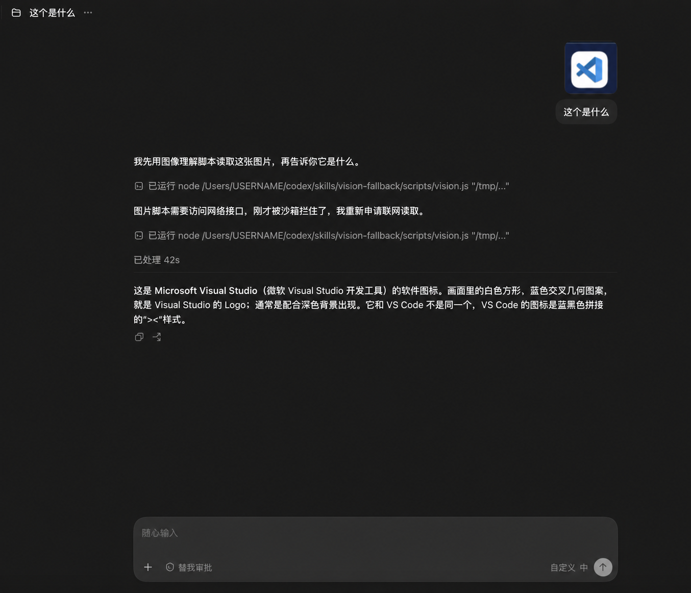
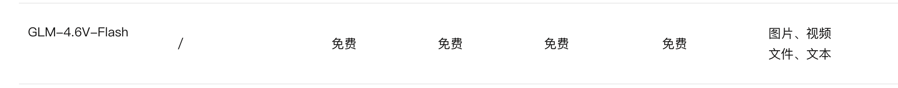

# Codex / DeepSeek 视觉回退（GLM）

让没有原生视觉能力的编码代理（例如通过 CC Switch 接入的 DeepSeek）自动读图；而官方 Codex / GPT 保持原生识图，**绝不把图片额外发送给第三方视觉 API**。



> 上图也是这套策略要解决的问题：有原生视觉能力时再调用外部模型，既浪费费用，也可能造成错误识别。正确路由规则已写入 [`AGENTS.md`](AGENTS.md)。

## 原理

```text
用户发图
  ├─ 官方 Codex / GPT ──> 原生识图（不出站）
  └─ DeepSeek / 文本模型 ──> scripts/vision.js ──> GLM 视觉 API ──> 中文图片描述 ──> 原模型继续处理
```

脚本将本地图片编码为 data URL，调用 OpenAI Chat Completions 兼容接口，再将模型返回的文字描述交还给代理。支持本地路径和远程图片 URL，并对 429 / “模型繁忙”做指数递增等待重试。

## GLM 配置



1. 注册并登录 [智谱 BigModel 开放平台](https://open.bigmodel.cn/)。
2. 在平台的 **API Keys** 页面创建 API Key；官方快速开始说明见 [获取 API Key](https://docs.bigmodel.cn/cn/guide/start/quick-start)。
3. 在本仓库中复制模板：

   ```bash
   cp scripts/.env.example scripts/.env
   ```

4. 仅在本机 `scripts/.env` 中填写 Key：

   ```dotenv
   VISION_API_KEY=你的真实_API_Key
   VISION_BASE_URL=https://open.bigmodel.cn/api/paas/v4
   VISION_MODEL=glm-4.6v-flash
   ```

5. 运行一次验证：

   ```bash
   node scripts/vision.js "/absolute/path/to/image.png" "请用中文描述这张图片"
   ```

`scripts/.env` 已被 `.gitignore` 忽略，绝不能提交。智谱接口使用 Bearer API Key 和 `https://open.bigmodel.cn/api/paas/v4` 基础地址；请以其[官方 API 文档](https://docs.bigmodel.cn/cn/api/introduction)为准，模型可用性与价格会变化。

## 安装为 Codex Skill

将本仓库放入 Codex skills 目录，例如：

```bash
git clone https://github.com/<你的用户名>/codex-deepseek-vision-fallback.git ~/.codex/skills/vision-fallback
cp ~/.codex/skills/vision-fallback/scripts/.env.example ~/.codex/skills/vision-fallback/scripts/.env
```

把本仓库的 `AGENTS.md` 规则合并到你使用的全局或项目级 `AGENTS.md`。若脚本放在 skills 目录，执行命令为：

```bash
node ~/.codex/skills/vision-fallback/scripts/vision.js "<绝对图片路径>" "请用中文详细描述这张图片的内容。"
```

切到 DeepSeek 后，新开或重启 Codex 会话，让它重新读取当前 provider 与规则。切回官方 Codex / GPT 后，规则会要求直接原生识图。

## CC Switch + DeepSeek 使用方式

1. 在 CC Switch 的 Codex provider 中启用 DeepSeek，并确认当前模型为文本模型。
2. 保持 `AGENTS.md` 中的“DeepSeek / 文本模型”分支。
3. 用户发图时，代理应先执行 `scripts/vision.js`，把返回的描述用于回答。
4. 切回官方 Codex / GPT 时不要执行脚本；GPT 自己读图。

CC Switch 对 Codex 的 Chat Completions 上游会经本地路由转换；切换 provider 后需重启当前会话并确认 `/model`。细节见 [CC Switch 路由指南](https://github.com/farion1231/cc-switch/blob/main/docs/guides/codex-deepseek-routing-guide-en.md)。

## 命令行用法

```bash
# 本地文件
node scripts/vision.js "/tmp/photo.jpg" "提取画面主体、文字和界面状态"

# 远程 URL
node scripts/vision.js --url "https://example.com/image.png" "请描述图片"
```

可选环境变量：

| 变量 | 作用 |
| --- | --- |
| `VISION_API_KEY` | API Key（优先级最高） |
| `VISION_BASE_URL` | OpenAI 兼容 API 基础地址 |
| `VISION_MODEL` | 视觉模型名 |
| `VISION_MAX_RETRIES` | 429 重试次数，默认 `5` |
| `VISION_RETRY_DELAY_MS` | 首次重试等待毫秒数，默认 `3000` |

同时兼容 `ZHIPU_API_KEY`、`GLM_API_KEY`、`DASHSCOPE_API_KEY` 等旧变量。脚本零 npm 依赖，使用 Node.js 内置网络模块。


## 许可证

[MIT](LICENSE)
